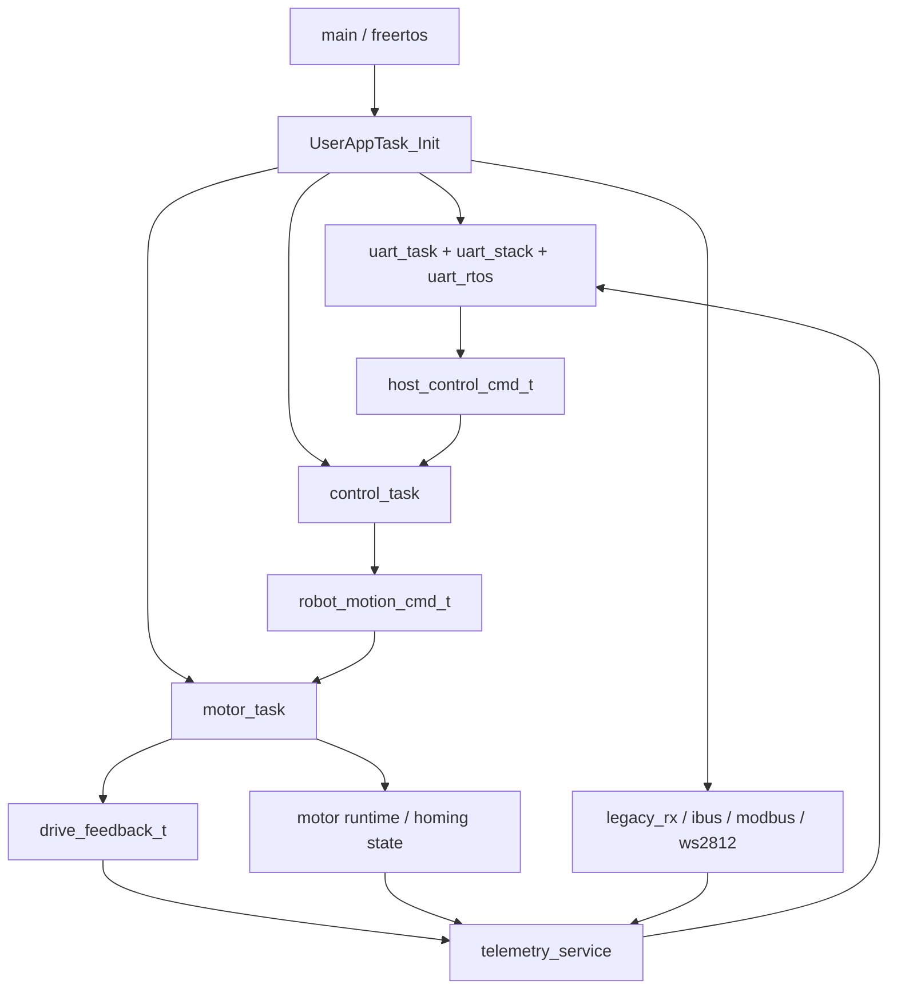
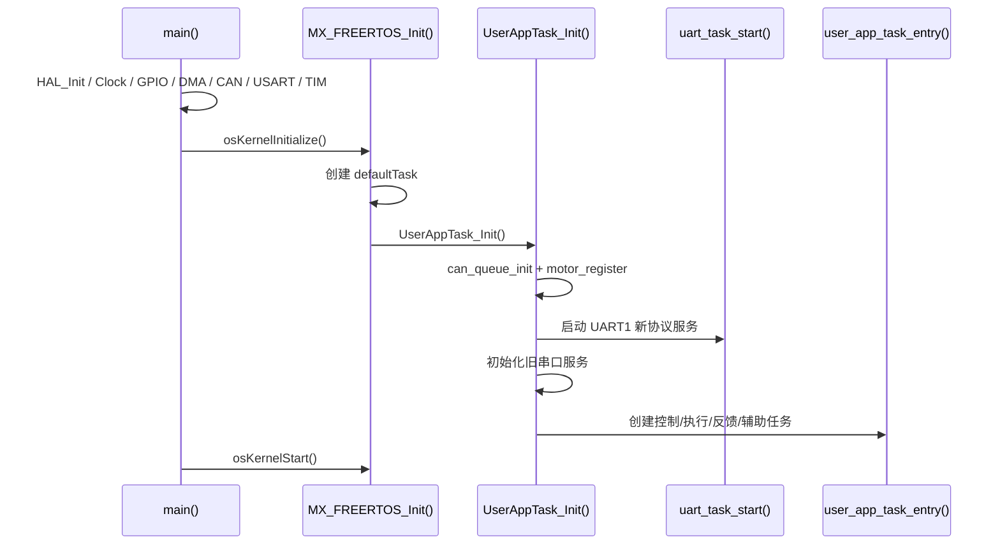

# 软件架构设计文档

##  架构目标

本项目的软件架构围绕“安全、可维护、可联调”三个目标设计：

- 将通信、控制、执行、反馈解耦
- 保证共享状态有明确所有权
- 让上位机命令与真实设备状态严格区分
- 让 100Hz UART 控制链与 100Hz 电机执行链对齐

## 架构分层

| 层级 | 主要模块 | 核心职责 |
| --- | --- | --- |
| 启动与平台层 | `main.c`、`freertos.c`、`Core/Src/*` | 时钟、外设、RTOS、基础中断入口 |
| MCU 抽象层 | `uart_port.c`、`gpio_port.c`、`can_port.c`、`*_irq_adapter.c` | 将 STM32F4 外设行为收口为统一接口 |
| BSP 与集成层 | `bsp_uart_driver.c`、`uart_rtos.c`、`uart_stack.c`、`legacy_uart_port.c` | 串口 FIFO/DMA、旧串口桥接、RTOS 适配 |
| 协议与会话层 | `host_protocol.c`、`uart_task.c` | 协议帧解析、TLV 解码、会话管理、主机 mailbox |
| 控制层 | `control_task.c` | 模式机、遥控解析、host 命令转运动命令 |
| 执行与反馈层 | `motor_task.c`、`drive_feedback_service`、`telemetry_service.c` | 电机仲裁、关节回零、真实状态聚合 |

## 总体架构图



## 关键状态对象与所有权

| 状态对象 | 所有者 | 写入口 | 读入口 |
| --- | --- | --- | --- |
| `host_control_cmd_t` | `uart_task.c` | 协议命令解析 | `control_task.c`、`motor_task.c` |
| `ROBOT_MODE_T` | `control_task.c` | 模式机 | 显示、执行、灯效 |
| `robot_motion_cmd_t` | `control_task.c` | 模式执行结果 | `motor_task.c` |
| 关节回零状态机 | `motor_task.c` | 执行层内部 | `control_task.c` 只读快照 |
| `drive_feedback_t` | `motor_task.c` | 轮速反馈任务 | `telemetry_service.c` |
| `telemetry_service_snapshot_t` | `telemetry_service.c` | 遥测聚合 | `uart_task.c` |

设计约束：

- 通信层不能直接操作电机
- 控制层不能直接操作电机驱动
- 遥测层不能把 host 意图伪装成真实反馈
- ISR 不直接调用业务逻辑

## 任务架构

| 任务 | 周期 | 优先级 | 作用 |
| --- | --- | --- | --- |
| `userTask` | 一次性 | 26 | 创建业务任务后自删除 |
| `ContronlTask` | 10ms | 25 | 模式执行、运动命令生成 |
| `ScramTask` | 10ms | 24 | 急停与限位输入采样 |
| `Motor_Task` | 10ms | 24 | 电机使能/失能/复位、回零、命令下发 |
| `Can_Analy_Task` | 1ms 级 | 24 | CAN 恢复、解析、发送、诊断维护 |
| `legacy_rx` | 1ms | 24 | 兼容串口收字节轮询 |
| `ibusTask` | 10ms | 24 | 遥控超时维护 |
| `Robot_Speed_Task` | 10ms | 22 | 轮速反馈刷新 |
| `ModbusTask` | 2000ms | 22 | 电池轮询 |
| `WS2812_Task` | 50ms | 21 | 模式、充电与转向灯效刷新 |
| `UART_TX` | 10ms | 默认 `idle+2` | UART1 周期发送 |
| `UART_RX` | 10ms | 默认 `idle+2` | UART1 周期读 FIFO |
| `UART_DMA_SVC` | 1ms 级 | 默认 `idle+1` | UART DMA 发送泵 |

## 关键数据流

### 下行控制链

```text
上位机
-> USART1 DMA/IDLE
-> bsp_uart_driver
-> uart_rtos RX task
-> uart_stack
-> host_protocol parser
-> uart_task_apply_command
-> host_control_cmd_t
-> control_task
-> robot_motion_cmd_t
-> motor_task
-> bsp_motor_handler / CAN1
```

### 上行反馈链

```text
电机反馈 / 电池 / 遥控 / GPIO / CAN 诊断
-> telemetry_service_snapshot()
-> uart_task_build_telemetry_tlv()
-> host_protocol builder
-> uart_stack
-> uart_rtos TX task
-> bsp_uart_driver
-> USART1 DMA TX
```

## 启动架构



## 安全架构

###  通信安全

- 会话超时 `1s`
- drive 命令新鲜度 `1s`
- lift 命令新鲜度 `1s`
- CRC16(Modbus) 校验
- 已识别 TLV 长度/范围错误按域拒绝
- 左右轮命令必须同帧成对出现

### 执行安全

- 急停优先级最高
- `MODE_READY` 默认不保持驱动轮带电
- 主机 disable 策略可阻断指定电机使能
- 关节未回零时禁止绝对位置控制
- 回零超时或异常进入 fault

### 上传安全

- `status_word` 仅反映真实执行状态
- `health_word` 仅反映真实健康状态
- 未接入传感器的可选字段不伪造

## 架构取舍

### 为什么使用“共享快照”而不是“命令队列”

- 当前业务更关心“最近一次有效命令”
- 控制层和执行层都按固定周期运行
- 更容易实现超时、模式切换、epoch 防抖和诊断逻辑

代价是：

- 必须严格管理临界区
- 必须明确所有权

### 为什么电机 power/reset 不放在控制层

- 这类动作属于执行权限，不属于控制策略
- 控制层只表达“运动意图”
- 执行层统一裁决可以减少双重真值和非法组合

## 后续架构扩展方向

- 引入自动化协议单元测试
- 接入更多真实状态源，补齐遥测
- 将故障码、事件日志做系统级统一管理
- 视需要扩展第二条新协议 UART 口

## 接手阅读顺序

如果下一个人要在 30 到 60 分钟内快速建立全局认知，建议按下面顺序读代码。

### 第一步：先看启动入口

| 顺序 | 文件 | 关键函数 | 作用 |
| --- | --- | --- | --- |
| 1 | `Core/Src/main.c` | `main()` | 完成时钟、GPIO、DMA、CAN、USART、TIM 初始化并启动 RTOS |
| 2 | `Core/Src/freertos.c` | `MX_FREERTOS_Init()` | 创建 `defaultTask`，调用 `UserAppTask_Init()` |
| 3 | `User/User_Init/User_Init.c` | `UserAppTask_Init()`、`user_app_task_entry()` | 初始化 UART1 新协议、旧串口服务，并创建所有业务任务 |

对应当前代码位置：

- `UserAppTask_Init()` 在 `User_Init.c:129`
- `user_app_task_entry()` 在 `User_Init.c:85`

### 第二步：看 UART1 新协议主链路

| 顺序 | 文件 | 关键函数 | 作用 |
| --- | --- | --- | --- |
| 1 | `Middlewares/components/host_protocol/host_protocol.c` | `uart_parser_feed()`、`uart_builder_end()` | 协议收包与构帧 |
| 2 | `BSP_Plantform/Bsp_Integration/uart/uart_stack.c` | `uart_stack_start()` | 将字节流和协议帧连接起来 |
| 3 | `BSP_Plantform/Bsp_Integration/uart/uart_rtos.c` | `uart_rtos_start()` | 创建 UART TX/RX 任务和 DMA service |
| 4 | `User/communication_task/uart_task.c` | `uart_task_start()`、`uart_task_apply_command()`、`uart_task_build_telemetry_frame()` | 真正的业务协议入口 |

对应当前代码位置：

- `uart_task_start()` 在 `uart_task.c:531`
- `uart_task_apply_command()` 在 `uart_task.c:381`
- `uart_task_build_telemetry_frame()` 在 `uart_task.c:334`
- `uart_session_is_alive()` 在 `uart_task.c:587`

### 第三步：看控制层如何消费命令

| 文件 | 关键函数 | 作用 |
| --- | --- | --- |
| `User/control_task/control_task.c` | `ContronlTask()` | 每 10ms 执行模式 |
| `User/control_task/control_task.c` | `robot_mode_update_50ms()` | 每 50ms 根据急停和 IBUS 切换模式 |
| `User/control_task/control_task.c` | `control_task_apply_slave_motion()` | 将 host mailbox 转成左右轮 rpm 和关节绝对位置命令 |
| `User/control_task/control_task.c` | `control_task_apply_manual_joint_motion()` | 手动模式下处理关节相对运动 |

对应当前代码位置：

- `ContronlTask()` 在 `control_task.c:122`
- `robot_mode_update_50ms()` 在 `control_task.c:495`
- `control_task_apply_slave_motion()` 在 `control_task.c:625`
- `control_task_apply_manual_joint_motion()` 在 `control_task.c:679`

### 11.4 第四步：看执行层如何裁决并下发

| 文件 | 关键函数 | 作用 |
| --- | --- | --- |
| `User/motor_task/motor_task.c` | `Motor_Task()` | 执行层主循环 |
| `User/motor_task/motor_task.c` | `motor_task_handle_drive_motor()` | 处理驱动轮 ready/enable 流程 |
| `User/motor_task/motor_task.c` | `motor_task_apply_drive_motion()` | 下发左右轮 rpm |
| `User/motor_task/motor_task.c` | `motor_task_process_joint_home()` | 关节回零状态机 |
| `User/motor_task/motor_task.c` | `Robot_Speed_Task()` | 刷新真实轮速反馈 |

对应当前代码位置：

- `Motor_Task()` 在 `motor_task.c:758`
- `motor_task_handle_drive_motor()` 在 `motor_task.c:474`
- `motor_task_apply_drive_motion()` 在 `motor_task.c:260`
- `motor_task_process_joint_home()` 在 `motor_task.c:517`
- `Robot_Speed_Task()` 在 `motor_task.c:794`

### 11.5 第五步：看遥测聚合结果

| 文件 | 关键函数 | 作用 |
| --- | --- | --- |
| `User/communication_task/telemetry_service.c` | `telemetry_service_snapshot()` | 汇总真实遥测 |
| `User/communication_task/telemetry_service.c` | `telemetry_service_diag_maintenance()` | 维护 CAN 诊断窗口 |

对应当前代码位置：

- `telemetry_service_snapshot()` 在 `telemetry_service.c:308`
- `telemetry_service_diag_maintenance()` 在 `telemetry_service.c:268`

## 12. 一条命令的完整落地路径

以下用“上位机下发左右轮角速度”为例说明完整链路：

1. `USART1_IRQHandler()` 在 `stm32f4xx_it.c:230` 响应串口空闲中断
2. `mcu_uart1_usart_irq_adapter()` 在 `uart_irq_adapter.c:6` 将 IDLE 转成驱动事件
3. `uart_dmarx_idle_isr()` 把 DMA 已收数据搬进 RX FIFO
4. `UART_RX` 任务通过 `uart_read()` 从 FIFO 取字节
5. `uart_stack` 逐字节调用 `uart_parser_feed()`
6. 形成完整帧后回调 `uart_task_on_frame()`
7. `uart_task_apply_command()` 解出 `0x01/0x02`
8. `host_control_cmd_t` 更新左右轮角速度和 `drive_cmd_seq`
9. `control_task_apply_slave_motion()` 将 `mrad/s` 转为 `rpm`
10. `Motor_Task()` 读取 `robot_motion_cmd_t`
11. `motor_task_apply_drive_motion()` 调 `motor_cmd_set_speed()`
12. 电机通过 CAN 执行，`Robot_Speed_Task()` 再把真实角速度写回 `drive_feedback_t`
13. `telemetry_service_snapshot()` 读取真实轮速并由 `uart_task` 打包上报

这个路径是理解项目的核心主线。只要把这 13 步串起来，就已经掌握了 70% 的工程结构。

## 13. 代码断点建议

### 13.1 协议不通

优先断在：

- `uart_task_on_frame()`
- `uart_task_apply_command()`
- `uart_parser_feed()`
- `uart_port_dma_rx_start()`

### 13.2 收到命令但底盘不动

优先断在：

- `control_task_apply_slave_motion()`
- `motor_task_handle_drive_motor()`
- `motor_task_apply_drive_motion()`

### 13.3 升降不动

优先断在：

- `control_task_apply_slave_motion()`
- `motor_task_process_joint_home()`
- `motor_task_apply_joint_motion()`

### 13.4 遥测不对

优先断在：

- `telemetry_service_snapshot()`
- `uart_task_build_telemetry_tlv()`

## 14. 接手时最容易踩坑的地方

- `SUB_SLAVE` 不是一进入就执行旧命令，必须有 post-entry 新命令。
- 遥测是“真实值”，不是 host 命令回显。
- `MODE_READY` 默认不带电，不要把 READY 理解成“可直接跑车”。
- 关节绝对位置控制必须先回零。
- `status_mask/status_value` 是锁存更新，不是一次性透传。
