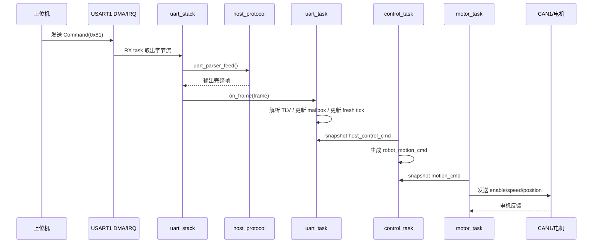
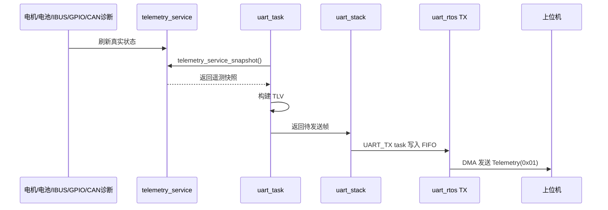
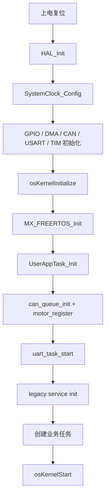
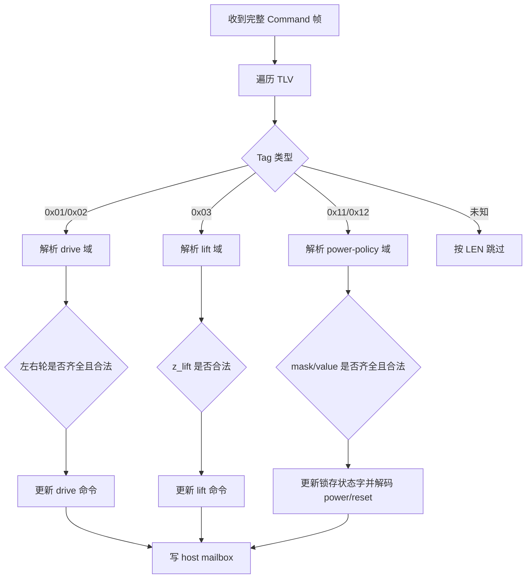
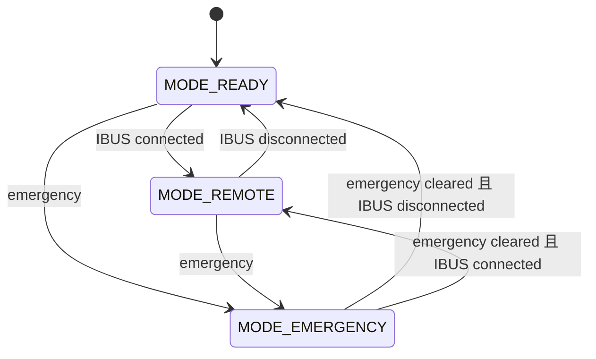
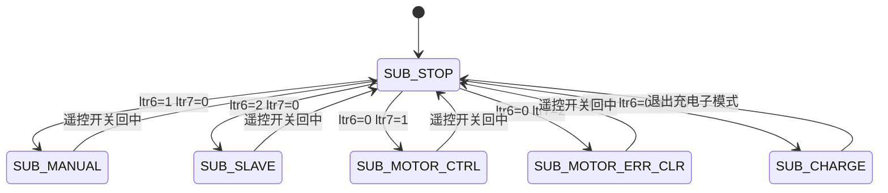
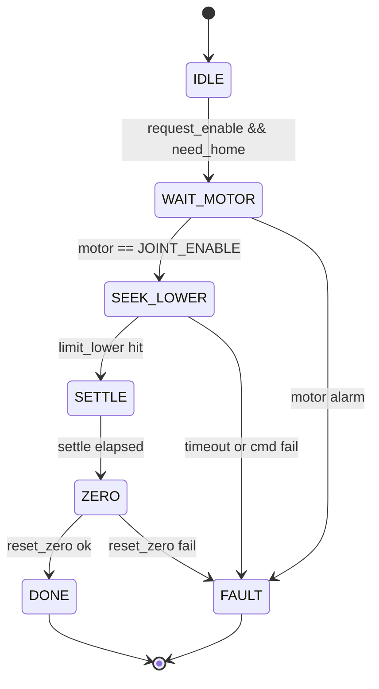
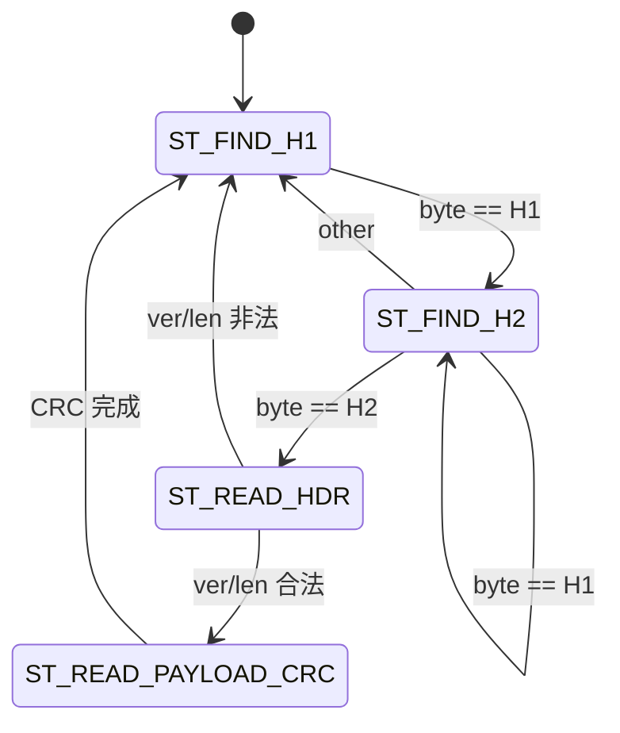

# 时序图 / 流程图 / 状态机图

## 1. UART1 下行命令时序图

```mermaid
sequenceDiagram
    participant Host as 上位机
    participant USART as USART1 DMA/IRQ
    participant Stack as uart_stack
    participant Proto as host_protocol
    participant UartTask as uart_task
    participant Ctrl as control_task
    participant Motor as motor_task
    participant CAN as CAN1/电机

    Host->>USART: 发送 Command(0x81)
    USART->>Stack: RX task 取出字节流
    Stack->>Proto: uart_parser_feed()
    Proto-->>Stack: 输出完整帧
    Stack->>UartTask: on_frame(frame)
    UartTask->>UartTask: 解析 TLV / 更新 mailbox / 更新 fresh tick
    Ctrl->>UartTask: snapshot host_control_cmd
    Ctrl->>Ctrl: 生成 robot_motion_cmd
    Motor->>Ctrl: snapshot motion_cmd
    Motor->>CAN: 发送 enable/speed/position
    CAN-->>Motor: 电机反馈
```

## 2. UART1 上行遥测时序图

```mermaid
sequenceDiagram
    participant Sensor as 电机/电池/IBUS/GPIO/CAN诊断
    participant Tele as telemetry_service
    participant UartTask as uart_task
    participant Stack as uart_stack
    participant RTOS as uart_rtos TX
    participant Host as 上位机

    Sensor->>Tele: 刷新真实状态
    UartTask->>Tele: telemetry_service_snapshot()
    Tele-->>UartTask: 返回遥测快照
    UartTask->>UartTask: 构建 TLV
    UartTask->>Stack: 返回待发送帧
    Stack->>RTOS: UART_TX task 写入 FIFO
    RTOS->>Host: DMA 发送 Telemetry(0x01)
```

## 3. 系统启动流程图

```mermaid
flowchart TD
    A[上电复位] --> B[HAL_Init]
    B --> C[SystemClock_Config]
    C --> D[GPIO / DMA / CAN / USART / TIM 初始化]
    D --> E[osKernelInitialize]
    E --> F[MX_FREERTOS_Init]
    F --> G[UserAppTask_Init]
    G --> H[can_queue_init + motor_register]
    H --> I[uart_task_start]
    I --> J[legacy service init]
    J --> K[创建业务任务]
    K --> L[osKernelStart]
```

## 4. UART1 命令处理流程图

```mermaid
flowchart TD
    A[收到完整 Command 帧] --> B[遍历 TLV]
    B --> C{Tag 类型}
    C -->|0x01/0x02| D[解析 drive 域]
    C -->|0x03| E[解析 lift 域]
    C -->|0x11/0x12| F[解析 power-policy 域]
    C -->|未知| G[按 LEN 跳过]
    D --> H{左右轮是否齐全且合法}
    E --> I{z_lift 是否合法}
    F --> J{mask/value 是否齐全且合法}
    H --> K[更新 drive 命令]
    I --> L[更新 lift 命令]
    J --> M[更新锁存状态字并解码 power/reset]
    K --> N[写 host mailbox]
    L --> N
    M --> N
```

## 5. 主模式状态机图

```mermaid
stateDiagram-v2
    [*] --> MODE_READY

    MODE_READY --> MODE_REMOTE: IBUS connected
    MODE_REMOTE --> MODE_READY: IBUS disconnected
    MODE_READY --> MODE_EMERGENCY: emergency
    MODE_REMOTE --> MODE_EMERGENCY: emergency
    MODE_EMERGENCY --> MODE_READY: emergency cleared 且 IBUS disconnected
    MODE_EMERGENCY --> MODE_REMOTE: emergency cleared 且 IBUS connected
```

## 6. Remote 子模式切换图

```mermaid
stateDiagram-v2
    [*] --> SUB_STOP
    SUB_STOP --> SUB_MANUAL: ltr6=1 ltr7=0
    SUB_STOP --> SUB_SLAVE: ltr6=2 ltr7=0
    SUB_STOP --> SUB_MOTOR_CTRL: ltr6=0 ltr7=1
    SUB_STOP --> SUB_MOTOR_ERR_CLR: ltr6=0 ltr7=2
    SUB_STOP --> SUB_CHARGE: ltr8=1 ltr6=0 ltr7=0
    SUB_MANUAL --> SUB_STOP: 遥控开关回中
    SUB_SLAVE --> SUB_STOP: 遥控开关回中
    SUB_MOTOR_CTRL --> SUB_STOP: 遥控开关回中
    SUB_MOTOR_ERR_CLR --> SUB_STOP: 遥控开关回中
    SUB_CHARGE --> SUB_STOP: 退出充电子模式
```

## 7. 关节回零状态机图

```mermaid
stateDiagram-v2
    [*] --> IDLE
    IDLE --> WAIT_MOTOR: request_enable && need_home
    WAIT_MOTOR --> SEEK_LOWER: motor == JOINT_ENABLE
    WAIT_MOTOR --> FAULT: motor alarm
    SEEK_LOWER --> SETTLE: limit_lower hit
    SEEK_LOWER --> FAULT: timeout or cmd fail
    SETTLE --> ZERO: settle elapsed
    ZERO --> DONE: reset_zero ok
    ZERO --> FAULT: reset_zero fail
    DONE --> [*]
    FAULT --> [*]
```

## 8. 协议解析器状态机图

```mermaid
stateDiagram-v2
    [*] --> ST_FIND_H1
    ST_FIND_H1 --> ST_FIND_H2: byte == H1
    ST_FIND_H2 --> ST_READ_HDR: byte == H2
    ST_FIND_H2 --> ST_FIND_H2: byte == H1
    ST_FIND_H2 --> ST_FIND_H1: other
    ST_READ_HDR --> ST_READ_PAYLOAD_CRC: ver/len 合法
    ST_READ_HDR --> ST_FIND_H1: ver/len 非法
    ST_READ_PAYLOAD_CRC --> ST_FIND_H1: CRC 完成
```
